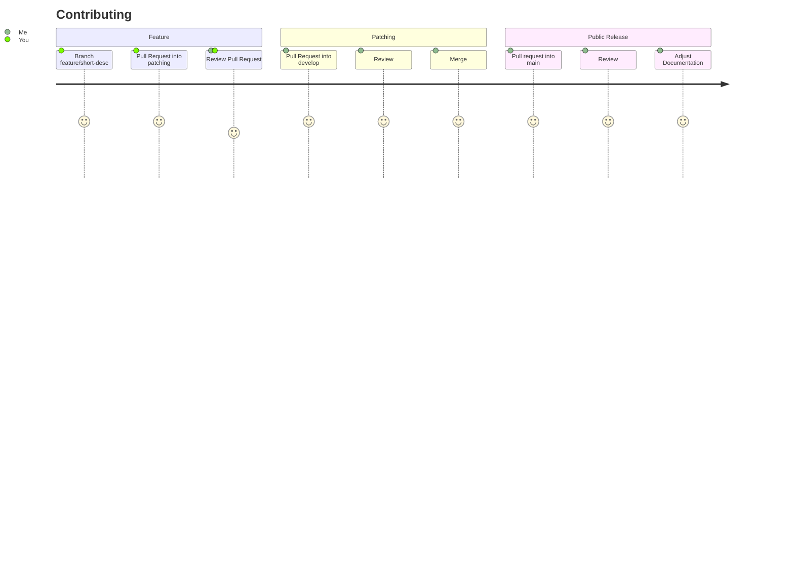

# Wordle Ranking Discord Bot

Use this bot in your server to enrich your Wordle game play in Discord!

**Technical Notes**

- This project samples Docker, GitHub Actions, Self-Hosting GH Runners, and testing in Python.
- It has many optimization points and areas of improvement before becoming a "production" ready Discord bot, but it works super well! 
- See [issues](https://github.com/baksha97/discord-wordle-stats/issues) to file a bug, optimization, or QoL enchancement!

## Features

### `$today`
Shows a ranking of today's games played. 
- View today's solution by clicking on the spoiler tag!
- Ranked in order of priority: won on, and created date.

### `$leaderboard`
Shows a ranking of the games played this month. 
- Ranked in order of priority: Average attempt won on, total games, win percentage, and when you first started playing.

### `$all-time-leaderboard`
Shows a ranking of all the games played. 
- Ranked in order of priority: Average attempt won on, total games, win percentage, and when you first started playing.

### `$wordle <id>`
Shows a ranking of a played Wordle. 
`$wordle 230` = Wordle 230
- View that solution by clicking on the spoiler tag!
- Ranked in order of priority: won on, and created date.

### `$activity`
Shows player activity over time. 

## Contributing 

## Github Workflows
- Intergrity Workflow
  - Runs Tests
  - Linting (TBD)
- Deployment Workflows (deploys Docker images)
  - Google Compute Engine
   - Deploys to the GCP/GCR/GCE container project specified in the Repository secrets.    
  - Self Hosted
   - Deploys to the same machine running the GitHub action instead! Still using Docker.

## Credit
Thank you [@shawnfelix](https://github.com/shawnfelix) for starting it off.
